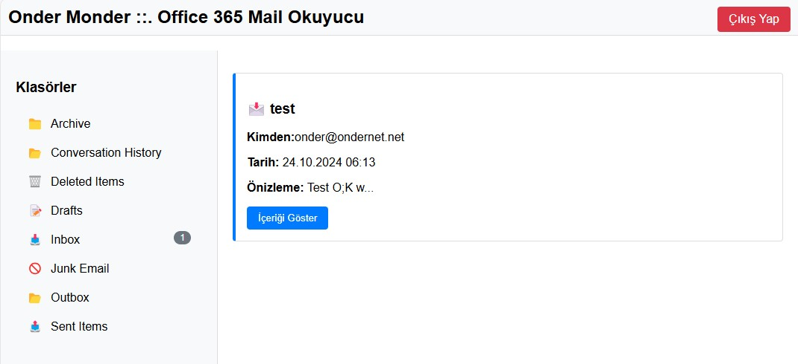

# O365Integration


<div align="center">



*Microsoft 365/Office 365 SMTP Entegrasyon Uygulaması*

</div>

## 📋 Genel Bakış
Bu proje, PHP kullanarak Microsoft 365/Office 365 SMTP yapılandırması ve OAuth2 ile e-posta işlemlerini yönetmenizi sağlar.

## ✨ Özellikler
- ✅ OAuth2 yetkilendirme desteği
- ✅ SMTP üzerinden e-posta gönderme
- ✅ Microsoft Graph API entegrasyonu
- ✅ HTML mail desteği
- ✅ Dosya eki desteği
- ✅ Mail okuma ve arama işlemleri
- ✅ Token yenileme mekanizması
- ✅ Hata yönetimi

## 🚀 Kurulum Adımları

### 1️⃣ Azure Portal Yapılandırması
1. Azure Portal'da yeni bir uygulama kaydı oluşturun
2. Aşağıdaki OAuth2 izinlerini ekleyin:
   - SMTP.Send
   - Mail.Read
   - Mail.Send
3. Redirect URI'ı yapılandırın
4. Client ID ve Client Secret bilgilerini alın

### 2️⃣ Composer ile Paket Kurulumu
```bash
composer require league/oauth2-client thenetworg/oauth2-azure phpmailer/phpmailer
```

### 3️⃣ Yapılandırma
`config.php` dosyasını kendi bilgilerinizle güncelleyin:
```php
define('CLIENT_ID', 'your_client_id');
define('CLIENT_SECRET', 'your_client_secret');
define('TENANT_ID', 'your_tenant_id');
define('REDIRECT_URI', 'your_redirect_uri');
```

## 📁 Proje Yapısı

```
O365Integration/
├── composer.json     # Paket bağımlılıkları
├── config.php       # Yapılandırma sabitleri
├── auth.php         # OAuth2 yetkilendirme
├── mailer.php       # E-posta gönderme işlemleri
├── mail_reader.php  # E-posta okuma işlemleri
├── callback.php     # OAuth2 callback işleyici
└── index.php        # Ana uygulama
```

## 📖 Kullanım Örneği

```php
// E-posta gönderme örneği
require 'mailer.php';

$mailer = new O365Mailer();
$mailer->send(
    'alici@ornek.com',
    'Test Mesajı',
    'Merhaba, bu bir test mesajıdır.',
    ['ek.pdf']
);
```

## ⚙️ Sistem Gereksinimleri
- PHP 7.4 veya üzeri
- Composer
- SSL sertifikası
- Microsoft 365/Office 365 hesabı

## 🛠️ Geliştirme Ortamı Kurulumu
1. Repoyu klonlayın
```bash
git clone https://github.com/onder7/O365Integration.git
```

2. Bağımlılıkları yükleyin
```bash
composer install
```

3. Yapılandırma dosyasını oluşturun
```bash
cp config.example.php config.php
```

4. Yapılandırma bilgilerini güncelleyin

## ⚠️ Hata Yönetimi
Uygulama şu hata durumlarını yönetir:
- 🔴 Yetkilendirme hataları
- 🔴 SMTP bağlantı hataları
- 🔴 Token yenileme hataları
- 🔴 API istekleri hataları

## 📝 Sürüm Geçmişi

### v1.0.0 (2024-02-16)
- ✨ İlk sürüm
- ✨ OAuth2 entegrasyonu
- ✨ SMTP desteği
- ✨ Graph API entegrasyonu

## 🔒 Güvenlik
> [!IMPORTANT]
> - Client Secret'ı güvenli bir şekilde saklayın
> - HTTPS kullanın
> - Token'ları güvenli bir şekilde depolayın
> - Rate limiting uygulayın

## 📱 İletişim
- 📧 E-posta: [onder7@gmail.com]
- 🌐 GitHub: [github.com/onder7]

## ⚖️ Lisans
Bu proje MIT lisansı altında lisanslanmıştır.

## 👥 Katkıda Bulunma
1. Fork edin
2. Feature branch oluşturun (`git checkout -b yeni-ozellik`)
3. Değişikliklerinizi commit edin (`git commit -am 'Yeni özellik eklendi'`)
4. Branch'inizi push edin (`git push origin yeni-ozellik`)
5. Pull Request oluşturun

## 🌟 Örnekler

### Mail Gönderme
```php
$mailer->sendHTML(
    'alici@firma.com',
    'Toplantı Daveti',
    '<h1>Toplantı Daveti</h1><p>Yarın saat 10:00...</p>'
);
```

### Mail Okuma
```php
$reader->getInboxMessages([
    'filter' => 'received gt 2024-02-01',
    'top' => 10
]);
```

> [!NOTE]
> Daha fazla örnek için [Wiki sayfamızı](https://github.com/onder7/O365Integration/wiki) ziyaret edin.

---

<div align="center">

**..:: Onder Monder ::..**

*Profesyonel IT Çözümleri*

</div>
